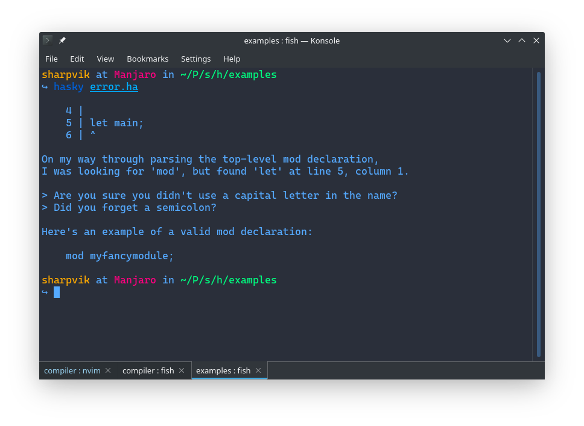

# Hasky Compiler

Hasky Compiler helps you transform high-level Hasky source code into
machine-level instructions.



## Usage

```bash
hasky help      # Print a brief help message.
hasky version   # Display current Hasky Compiler version.
hasky SOURCE.ha # Compile one Hasky file (mostly used for debug).
```
